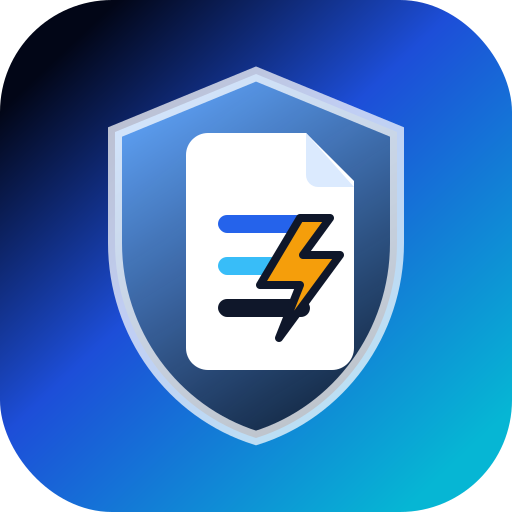

<h1 align="center">FormForge</h1>

<div align="center">
  A forever-free, open-source, privacy-first form backend for static sites you can self-host on Cloudflare Workers + D1.
  <br />
  <br />
  🔓 <em>No paid database required.</em> 📀 <em>Own your data.</em> ⚡️ <em>Deploy fast.</em>
</div>

<br />

<div align="center">
  
</div>

<br />

<div align="center">
  Perfect for <em>contact forms</em>, <em>waitlists</em>, <em>surveys</em>, <em>newsletter signups</em>, <em>lead forms</em>, and more.
</div>

<br />

---

## ⚡ Deploy to Cloudflare in Seconds

Deploy your own serverless form backend in seconds - as easy as signing up for a commercial service:

<div align="center">

[](https://deploy.workers.cloudflare.com/?url=https://github.com/adrianak2026/FormForge)

</div>

### How Deploy to Cloudflare Works

Here's what happens when you click the button:

1. Cloudflare creates a copy of this repository in your GitHub account.
2. You provide configuration options:
   - **Project name** (e.g., "formforge")
   - **Database name** (e.g., "formforge-db")
   - **AUTH_SECRET** (Generate a strong secret key using [jwtsecrets.com](https://jwtsecrets.com) or `openssl rand -hex 32` to sign authentication sessions).
3. Cloudflare builds and deploys FormForge directly into **your own Cloudflare account** (fully within Cloudflare's free tier).
4. You get a unique URL (e.g., `https://formforge.YOUR-SUBDOMAIN.workers.dev/dashboard`) to access your dashboard.

> **💡 Note:** `RESEND_API_KEY` and `RESEND_FROM` are optional secrets. Leave them blank if you don't need email notifications.

---

## Why FormForge?

FormForge is inspired by simplicity, but upgraded for a modern Cloudflare-native stack:

- **No DATABASE_URL build failure** — no PostgreSQL pool is initialized at build time.
- **Cloudflare D1 by default** — free-tier friendly SQLite database built into Workers.
- **OpenNext Next.js app** — deploys to Cloudflare Workers with `@opennextjs/cloudflare`.
- **Privacy first** — data stays in the deployer’s Cloudflare account; IP addresses are hashed per form.
- **No artificial SaaS limits** — your limits are your Cloudflare plan and D1 quotas.
- **Export anytime** — CSV export endpoint prevents vendor lock-in.

---

## Features

- Submit plain **HTML forms** with an `action` URL.
- Submit **JSON payloads** from `fetch`, XHR, React, Astro, Vue, Svelte, or any frontend.
- Create unlimited forms and private endpoints.
- D1-backed users, sessions, forms, fields, submissions, API keys, notifications, rate limits, and audit logs.
- Submission listing and CSV export.
- Honeypot spam trap.
- Origin allowlist for browser submissions.
- Optional proof-of-work validation.
- Optional webhook notifications.
- Optional Resend-compatible email notifications.
- Secure cookies, HMAC-hashed sessions/API keys, PBKDF2 password hashes.
- **Self-healing schema** — tables are created automatically on first request (no manual migration step for one-click deploy).
- **Real dashboard** at `/dashboard`: register/login, create forms, view submissions, copy HTML snippets, export CSV, manage API keys, pagination, and revoke API keys.
- Responsive product UI, branded favicon/logo, and detailed `/docs.html`.

---

## Tech Stack

- **Next.js 16 App Router** + **React 19**
- **Cloudflare Workers** via **OpenNext** (`@opennextjs/cloudflare`)
- **Cloudflare D1** using **Drizzle ORM** (`drizzle-orm/d1`)
- **Tailwind CSS**
- **Wrangler** for deploy and D1 migrations

---

## 🛠️ Manual Setup (Alternative)

If you prefer to set up manually instead of using the one-click button:

```bash
# 1. Clone & install
git clone https://github.com/adrianak2026/FormForge.git
cd my-form
npm install

# 2. Login to Cloudflare
npx wrangler login

# 3. Auto setup (interactive — asks app name, db name, auth secret)
npm run setup

# OR do it manually:

# 3a. Create D1 database
npx wrangler d1 create formforge-db
# Copy the database_id and paste it in wrangler.jsonc

# 3b. Set AUTH_SECRET
npx wrangler secret put AUTH_SECRET
# Paste your generated secret

# 3c. Deploy
npm run deploy
```

---

## Environment Variables

| Variable | Required | Description |
| --- | --- | --- |
| `AUTH_SECRET` | ✅ Yes | Long random secret for HMAC session/API-key hashing. Generate with `openssl rand -hex 32`. |
| `RESEND_API_KEY` | ❌ Optional | Enables email notifications only when configured. Leave blank to disable. |
| `RESEND_FROM` | ❌ Optional | Sender address for email notifications, for example `FormForge <forms@example.com>`. |
| `DB` | ✅ Yes | Cloudflare D1 binding name. Configure as a D1 binding, not as a string secret. |

Do **not** set `DATABASE_URL`. FormForge uses Cloudflare D1 by default.

---

## API Examples

### Register owner

```bash
curl -X POST https://YOUR-WORKER.workers.dev/api/auth/register \
  -H 'Content-Type: application/json' \
  -d '{"email":"owner@example.com","name":"Owner","password":"change-this-password"}'
```

### Create a form

```bash
curl -X POST https://YOUR-WORKER.workers.dev/api/forms \
  -H 'Content-Type: application/json' \
  -b cookies.txt -c cookies.txt \
  -d '{"name":"Contact","allowedOrigins":"https://example.com"}'
```

### Use in HTML

```html
<form method="POST" action="https://YOUR-WORKER.workers.dev/api/submit/endpoint_xxx">
  <input name="email" type="email" required />
  <textarea name="message" required></textarea>
  <input name="website" tabindex="-1" autocomplete="off" hidden />
  <button>Send</button>
</form>
```

### Use with fetch

```js
await fetch("https://YOUR-WORKER.workers.dev/api/submit/endpoint_xxx", {
  method: "POST",
  headers: { "Content-Type": "application/json" },
  body: JSON.stringify({ email: "hello@example.com", message: "Hi" }),
});
```

---

## Production Checklist

- ✅ The `database_id` in `wrangler.jsonc` is blank on purpose — Cloudflare creates the D1 database for you on first deploy.
- ✅ Set a strong `AUTH_SECRET` in Cloudflare secrets.
- ✅ FormForge self-heals its schema on first request, so no manual migration step is required (SQL migrations are included as a backup).
- ⚠️ Set `allowedOrigins` for each form instead of `*` when possible.
- ⚠️ Keep email/webhook integrations disabled unless needed.
- 📋 Open `/dashboard` after deploy to create an owner account, forms, and view submissions.
- 📋 Export submissions periodically if your compliance policy requires offline backups.

---

## Troubleshooting

### `Network error. Is the Worker deployed and D1 bound?`
This means the frontend cannot reach the API.
1. **Worker not deployed** — Click the deploy button above or run `npm run deploy`.
2. **D1 database not created** — The deploy button creates it automatically. For manual setup, run `npx wrangler d1 create formforge-db` and add the `database_id` to `wrangler.jsonc`.
3. **AUTH_SECRET not set** — Run `npx wrangler secret put AUTH_SECRET` and paste your secret.

### `Error: DATABASE_URL is required`
This means old PostgreSQL code is still being imported. FormForge removes `pg`, uses `drizzle-orm/d1`, and exposes `getDb()` so database access happens only inside request handlers.

### D1 binding not found
Confirm the binding name is exactly `DB` in `wrangler.jsonc` and in the Cloudflare dashboard.

---

## License

MIT
